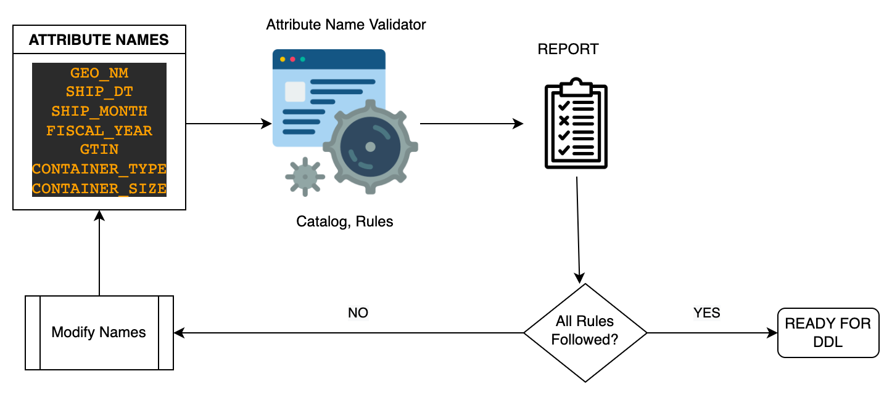

### ATTRIBUTE NAMING GUIDELINES

#### What are the issues faced during the process of deciding column names of objects in physical data layer?


**In our usual process** of naming columns, intentionally, or unintentionally **we use a mix of both
sources manually to come up with names for columns**.
This makes the process of deciding on column names extremely fluid and inconsistent.

**Following are, few of the consequences.**

1. We often use abbreviated words in column names on the basis that,
   1. they were already also used in upstream objects, or
   2. It's a legacy column, and we use it, as is - thus violating naming rules
   3. they were used in similar columns of other existing objects.
2. We do not use class words sometimes for columns and this gets overlooked in the process.
3. We sometimes use class words in the middle of objects. It often gets overlooked, if they conform to
enterprise naming rules or not.
   1. If is the sole class word used in the column name, it defeats the purpose of class word
   (classification and easier understanding data qualities of column by looking at the last word).
4. Sometimes we use approved abbreviations for class words, sometimes we just use the full class word.
   1. **`WDTH` or `WIDTH`, `WT` or `WEIGHT`, `PRC` or `PRICE`, `PCT` or `PERCENT`, `YRS` or `YEARS`** etc.
5. We sometimes make up new acronyms or abbreviations or compose words together adhoc, as suited for a situation and
propagate them further in downstream objects.

Since there is no tool/platform to use, to get feedback on column names during the process of naming,
all the above actions further propagate inconsistencies in column naming across Data Landscape.

### GIST OF PHYSICAL DATA NAMING STANDARDS

**Apply to Data at Rest:**
1. The Data Lake (ex: S3)
2. The Data Warehouse (ex: Snowflake)

**Column Names in Physical Layer:**

**All physical names will simply be the full logical name (see exceptions in catalog for limited abbreviations)** with a
specified physical platform separation scheme to replace the spaces as follows
1. **SNOWFLAKE** - **REPLACE_SPACES_WITH_UNDERSCORES_AND_USE_UPPERCASE** (set as Snowflake uses case to determine uniqueness)
2. **HIVE** METASTORE (for our Data Lake) - **replace spaces with underscores**.

**Abbreviation usage Exceptions to Full Names:**

1. Where **APPROVED ACRONYMS** exist for a logical name, those acronyms may be used in the physical name
2. **ALL CLASS WORDS** - which always **come at the END of a column name**.

** Class Word **Abbreviations apply to NDF Curated, Integrated, and Aggregated layers**. These do not apply
to integration based canonical models as they specify the full word.


 **Primary Keys:**
1. This will often just be the Table Name as the qualifier (e.g. Employee) followed by ID (e.g. Employee_ID)

 **Foreign Keys:**

1. Where a primary key from one table is used as a foreign key in another table, it should keep the same original name.
2. Where a primary key from one table is used in more than one way, appropriate role-playing names should be applied
   1. e.g. In an Employee table, where the primary key is "Employee_ID", a foreign key to the employee's manager would
   need to be role-named - e.g. "Manager_ID"
   2. e.g. in a Project table, with references to multiple employees, each foreign key reference would need an
   appropriate role name - e.g. Scrum_Master_ID, Solution_Architect_ID, etc.

**Understanding and consistency in names are much more important than shortness going forward**
1. Yes, it takes longer to type the names, BUT the architectural principles of Simplicity and
Ease of Use far outweigh this.
2. Easily understood as ideally data names will be written once, but consumed multiple times.

**Physical Column Ordering**

1. WHY? - The reason for this ordering is, **to FACILITATE ease of consumption**. Ordering does not affect the
performance in Snowflake.
2. Columns should be ordered as follows within views or tables in physical databases
   1. Primary Key (PK) Columns
   2. Everything else in alphabetic order (except Audit/HouseKeeping columns)
   3. Standard Audit/Housekeeping columns (e.g. Create Date, Last Update Date, etc.)


**Potential Exception Needs to be Considered for Data-In-Motion Structures for Data Payloads**

1. Noting for future discussion, consider standard abbreviations for data-in-motion payloads. (These don't apply to data
at rest - see above).
2. Need to collaborate with API standards group & Streaming Platforms
3. Reason is that **full names in the data descriptions for API/dynamic payloads** (e.g. JSON or XML structures) can
**lead to increased network load** (size of payloads) and performance impacts


#### What are Class Words?
1. **Column name is composed of two basic parts**:a Naming Qualifier and a Class Word.
2. **Column names should end in one of the class words** to assist in uniformity and understanding across our name
spaces, representing the high-level category (type or class) to which the data in column belongs.
3. **Class words describe the** "type" or **"class" of data elements** (such as amounts, counts, indicators, etc.), for example,
 **`Employee_First_Name`** where **`Name`** is the class word.
4. Class words are required EVEN if an acronym used as a qualifier includes a class word in the acronym
   1. For example, **`MSRP`** would need to be **`MSRP_Price`** .
5. For time intervals, having an additional prefixing class word is optional, and may be added as desired to add clarity
e.g. Count, Length, Number, Quantity or Time may be optionally added as qualifiers.
   1. Ex: **`Material_Lead_Tm_Days, Plant_Build_Early_Planned_Nbr_of_Days`** etc.
6. There can be other **composite class words** too, such as below
   1. **`Travel_Expense_Amt_USD, Material_Cost_USD, Retail_Prc_USD`** etc.


#### List of approved Class Words and Acronyms
* List of Class Words for this package are in CATALOG.xlsx
* List of Approved Acronyms for this package are in CATALOG.xlsx


### INSTALLATION & USAGE OF TOOL

This pacakge is used as  CLI to get the feedback on column names of a given entity, when validated against Naming Standards

* create a text file with a list of column names to be used for an object in physical data layer(ex: SNOWFLAKE).
* run the `anv <COLUMN_NAMES_TEXT_FILE>`  command providing the column names text file.
* see the feedback generated in "reports" folder.

**INSTALLATION**
```shell script
$ pip3 install git+https://github.com/siddartham/attribute-name-validator.git
```
**REPORT GENERATION**
```shell script
$ attribute-name-validator COLUMN_NAMES_TEXT_FILE
```
**OUTPUT**
```shell script
$ ls reports/
COLUMN_NAMING_GUIDELINES_AND_ANALYSIS_REPORT_USAGE.html       CATALOG.xlsx                                            COLUMN_NAMES_TEXT_FILE_REPORT.xlsx
```

**HOW TO USE THE REPORT**
#### Workflow


On running the command on a column names text file or a folder with column name files,
the tool produces **two generic files**, one XLSX file with the class word and acronym catalog
 used for the analysis and this HTML page with brief description of naming rules and package usage.

1. **`reports/CATALOG.xlsx`** - Has the entire Catalog of Enterprise Approved Class Words and Acronyms considered in naming analysis.
2. **`reports/COLUMN_NAMING_GUIDELINES_AND_ANALYSIS_REPORT_USAGE.html`** - This HTML page expanding on the usage of package and reports generated.
It also has references to Enterprise Naming Guidelines.


The tool **generates a report per object** named **`reports/ENTITY_NAME_REPORT.xlsx`**, highlighting potential violations.

**In an ideal situation, the report generated for a given entity, ** would have the following.
1. **`CLASS_WORD_RULES_FOLLOWED?`** column in **`CLASS_WORDS_ANALYSIS`** sheet should be `YES` or `MAY BE` for all entries.
However, **review** the ones with **`MAY BE`** or **`NO`**.
2. There should be **no ABBREVIATIONS or ACRONYMS or COMBINEDWORDS in `FULL_WORDS_USED`** sheet.
For example, if words such as  **`SESN`** or **`CHNL`** or **`GEO`** or **`CRBN`** or **`PRODCAL`** or **`ITEMTYPE`** or
**`PRICEMODIFIER`** etc., and other similar words appear in the list, which are neither english/other language words,
nor part of approved abbreviated class words or acronyms, they stand in violation of enterprise guidelines and
thus have to be changed to their full word forms.
3. For all the entries in **`APPROVED_ABBREVIATIONS_USED`** sheet, meanings of **short-forms used in naming columns should match one of
the meanings**. For example, if **`STD` is used** by developers of object **to mean `STANDARD`, and not
`SEASON TO DATE`**, an approved Acronym, the `USED_CATALOG` report, against `STD` approved usages, would not
show `STANDARD`, only shows `SEASON TO DATE`, thus **have to rename it**, even though `STD` is an approved
abbreviation, but for a different purpose.


**FOR FURTHER USAGE OF THE TOOL**
```shell script
$ anv -h
usage: attribute-name-validator [-h] [-l] [--write-to-text-files] target_path

This command generates report on naming analysis from either a list of column name files in a folder,
or a given column names file, by looking up the words used to the column names in a local Abbreviation catalog
 that comes with the installation of package. On the execution of this command, you will also have a reports
folder created with CATALOG.xlsx and COLUMN_NAMING_GUIDELINES_AND_ANALYSIS_REPORT_USAGE.html files,
which have more information related to the working of the tool

To add a set of Class Words Abbreviations and Acronyms, as exceptions beyond current enterprise guidelines
create anv.ini file and add exceptions under respective sections, as shown below

[additional-catalog]
acronyms = LOB
class-word-abbreviations = IN, IN3, CM3, LB

positional arguments:
  target_path           Path to file with column names or folder with column name files to analyze

optional arguments:
  -h, --help            show this help message and exit
  -l, --log             This flag, if present, shows logs of execution in sys.stdout.
  --write-to-text-files, -wttf
                        This flag, if present, also creates text files of reports under their respective entity specific folder.

```


### FUTURE DEVELOPMENT, EXTENDING SUPPORT FOR NEW ENTRIES IN THE CATALOG, CHANGES TO NAMING RULES

2. Functionality of this tool can be extended for further development of new features, addition/modification to
the ruleset, addition of new entries to the catalog.
3. Would need to run the tool with column names in different kinds of objects used in physical data layer
   across the enterprise, to capture the widely used class words, acronyms that are currently not part of the catalog.
4. Further, updates to class words sheet is needed.
   1.  Use the reports generated above to review usage patterns and potential additions to
   class words and acronyms, or even addition of new sheets to the catalog such as list of words maintained as
   **`EXCEPTIONS TO CLASS WORD RULES`, `EXCEPTIONS TO ABBREVIATED WORDS`**.
   2. going by last words of certain columns such as **`_CM3`, `_IN`, `_IN3`** , they need to be added to catalog
   3. additional of classes words for new use cases for sustainability related data sets, like **`C02E`** or **`C02EKG`** etc
   4. should **`_WTD`, `_MTD`, `_YTD`, `_4WK`, `_12WK`** etc., be added to class words, or as exceptions to class words?
5. Further, updates to acronyms sheet is needed, going by the current usage, such as **`LOB, RTL`** etc.
6. Needs Clarity on "mandatory usage of class word abbreviation" rule in physical data layer.
   1. Is class word abbreviation(not full class word) mandatory - at the end?
   2. Is full class word usage allowed - in the middle?
   3. We are currently using both full forms and abbreviated forms for class words in column naming at different
   places, making the names of columns inconsistent. For example, sometimes we use **`_PRICE`**, sometimes **`_PRC`**,
   sometimes **`_WEIGHT`**, sometimes **`_WT`**,  **`_WIDTH`**, sometimes **`_WDTH`**, but not **`_WH`** - makes it more confusing.
   4. A better approach would be to **do away with** all **class word abbreviations**, **except where it is warranted**
      1. We do not need abbreviations for class words such as, **`_PRC`** for **`_PRICE`**, **`_WGHT` for `_WEIGHT`**,
      **`_WDTH`** for **`_WIDTH`**, **`_AMT`** for **`_AMOUNT`**,
      **`_TXT`** for **`_TEXT`, `_TM`** for **`_TIME`, `_VOL`** for **`_VOLUME`, `_NM`** for **`_NAME`, `_CNT`** for **`_COUNT`** etc.
      2. We are not saving many strokes on keyboard, while inviting lot more inconsistency in the naming, with them.
      3. **`_KG`** for **`_KILOGRAMS, _M`** for **`_METERS, _M2`** for **`_SQUAREMETERS, _M3`** for **`_CUBICMETERS, _CM`** for **`_CENTIMETERS,
      _CM3`** for **`_CUBICCENTIMETERS, _CO2E`** for **`_CO2EQUIVALENT, _UOM, _USD, _UTC, _UUID,`**  etc. and more Class Words like that
      can be allowed as they,
         1. have a universal understanding of what they mean and easier to follow and
         2. saves keystrokes, while making it easy for the identification of the class, the column value belongs to.
      4. **To implement the above,** we just need to update abbreviation column in class words sheet, to have full class word
       where it is not a necessity.
7. Need to compose the full list of class words which need extra qualifier class word at the end.
8. Further, updates to logic in the pacakge need to be made, as needed by Data Governance Platform.
9. **`CATALOG.xlsx`** needs to be updated as needed by the DGP, with requests coming for new custom class words which don't
fall into any of the suggested category of class words.
10. Expand on **`ACRONYMS`** sheet Ex: **`LOB`** - a well-used acronym, but not part of catalog.
11. We may need a list of approved abbreviations(a new sheet), if approved by DGP as exceptions for abbreviation usage
for some words.
12. Class Words sheet needs to be updated to support enterprise wide use cases. For example: Currently **`_WTD, _MTD`**,
while being approved acronyms, also used at the end?. **`_YEAR, _MONTH`** are not approved class words, do they have to be
13. Further, updates to logic for better feedback. For example: **`_DAY, _YEAR, _MONTH`** are not approved class words - suggest
 that they need a class word qualifier like a **`_MONTH_NBR, _MONTH_TXT, _DAY_NBR`** ?
14. Extend **`FULL_WORD_REPORT`** sheet in the report to have a new column, **`SYNONYM`/`MEANING`**, whose value is generated for every
**`FULL_WORD_REPORT`** by looking up an English language words catalog of an **`NLTK`** library. The value in the column for
a given word, would give further feed back on, if that is what they mean. - TODO
    1. If the column is empty, then there is no english word with that name.
    2. If there is value in column, ensure that column is used for one of the meanings mentioned, not a short form word
    with the same text.
    3. This is to ensure, any abbreviated word doesn't slip through, as the acronym or abbreviation spells like an actual word.


### ISSUES WITH COMPLIANCE
Above reported inconsistencies is **primarily because of two things**
- Lack of **tools**, to iterate through for feedback while naming columns.
- Lack of **processes**, to follow, while deciding on column names.


### HOW TO IMPLEMENT NAMING GUIDELINES USING THIS TOOL?

There are two ways to go about it.

#### END USER INSTALLATION

You can install this package from GitHub/PYPI. Anyone can install the package locally and
run the command providing a column names file, as they build new objects.
Every system(PC or MAC) comes with python by default, but would need to ensure **`~python3.8`** to install this package.
just have to install the package running above command.


##### DRAWBACKS
**However**, to have that communication regarding package installation passed down
to everyone, and expect everyone working on deciding column names, to install this on their system without the
complications of few of them, having unsupported python version(**`<py3.8`**) of python, would be too much of a hassle.

**Even more challenging task, is to expect every one to** generate reports for column names based on then latest
Data Governance Platform approved catalog data set and rules, **by upgrading the package** as CATALOG.xlsx is a living document,
and naming rules can change. DGP is expected to update it as and when a need arises.


#### LIGHTWEIGHT CLIENT WITH REMOTE CALLS

Alternatively, can use a lightweight client, with Catalog and rules hosted in cloud.

##### DRAWBACKS
1. Would need to deal with authentication from CLI to access the API
2. Would still need intermittent upgrades to the package
   1. less frequent than before, as catalog and naming rules used will always be up-to-date,
   2. but would need to upgrade the client at some point, if there are breaking
   changes in remote calls to the API.
3. Technically involved for everyone to use it.


#### HOSTING IT AS A DATA GOVERNANCE TOOL

A much easier method to propagate consistent column naming rules across enterprise would be to host it on a
well communicated data governance platform and add to column naming process, a step to upload the document to the
site and get a report generated by the tool and iterate the same with changes made as a process to follow while
building/modifying an object.

This way, every person working on naming columns, would always get feedback based on latest catalog and rules
approved by Data Governance Platform.

From the Data Governance Platform end,

They need to maintain the latest catalog and naming logic with the package as before.
and deploy it at a well communicated end point to be consumed by users across the organisation,
in the process of deciding column names.

Thus, the latest catalog of abbreviations & rules approved by Data Governance Platform would be consumed by
everyone in the org for feedback, by just going back to the same hosted tool. Rather than any other individual
action, everyone has to take, like upgrading to the latest package every time they have a
task of deciding column names, since one can't be sure that the package they installed sometime back,
has the latest catalog and naming rules from DGP.
